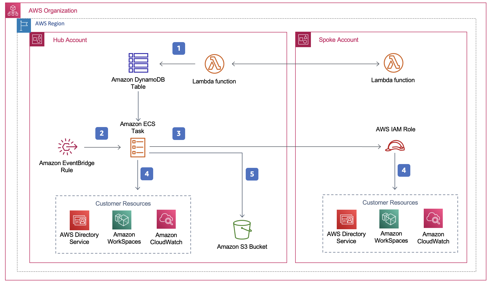

**[🚀 Solution Landing Page](https://aws.amazon.com/solutions/implementations/amazon-workspaces-cost-optimizer/)** | **[🚧 Feature request](https://github.com/awslabs/<insert-solution-repo-name>/issues/new?assignees=&labels=feature-request%2C+enhancement&template=feature_request.md&title=)** | **[🐛 Bug Report](https://github.com/awslabs/<insert-solution-repo-name>/issues/new?assignees=&labels=bug%2C+triage&template=bug_report.md&title=)**

Note: If you want to use the solution without building from source, navigate to Solution Landing Page

## Table of contents

- [Solution Overview](#solution-overview)
- [Architecture Diagram](#architecture-diagram)
- [Getting Started](#getting-started)
- [Customizing the Solution](#customizing-the-solution)
  - [Build](#build)
  - [Unit Test](#unit-test)
  - [Deploy](#deploy)
- [File Structure](#file-structure)
- [Collection of operational metrics](#collection-of-operational-metrics)
- [License](#license)

<a name="solution-overview"></a>
# Solution Overview
Amazon WorkSpaces, a fully managed, secure virtual desktop computing service on the AWS Cloud, eliminates the need for customers to procure, deploy, and manage complex virtual desktop environments. Amazon WorkSpaces offers the flexibility to pay hourly or monthly without any up-front commitment.

To help customers with unpredictable WorkSpace usage patterns monitor their Amazon WorkSpaces usage and optimize costs, AWS offers the Amazon WorkSpaces Cost Optimizer, a solution that analyzes all of your WorkSpace usage data and automatically converts the WorkSpace to the most cost-effective billing option (hourly or monthly) depending on the user's individual usage. This solution is easy to deploy and uses AWS CloudFormation to automatically provision and configure the necessary AWS services.

<a name="architecture-diagram"></a>
# Architecture Diagram


<a name="getting-started"></a>
# Getting Started
Deploy the [WorkSpaces Cost Optimizer CloudFormation Template](https://s3.amazonaws.com/solutions-reference/workspaces-cost-optimizer/latest/workspaces-cost-optimizer.template)
For the full solution overview visit [WorkSpaces Cost Optimizer on AWS](https://aws.amazon.com/solutions/implementations/amazon-workspaces-cost-optimizer/)

<a name="aws-solutions-constructs"></a><a name="customizing-the-solution"></a>
# Customizing the Solution

<a name="build"></a>
## Build

Clone the repository

```
git clone git@github.com:awslabs/workspaces-cost-optimizer.git
```

Set the destination bucket name- this bucket should be in the region you're deploying the solution to.

```
export TEMPLATE_BUCKET_NAME=<YOUR_TEMPLATE_BUCKET_NAME>
export DIST_BUCKET_NAME=<YOUR_DIST_BUCKET_NAME>
export SOLUTION_NAME="workspaces-cost-optimizer"
export VERSION=<VERSION>
## NOTE THAT the region is appended to the DIST_BUCKET_NAME (DIST_BUCKET_NAME-REGION) when deployed, so creating a bucket with only Bucket_Name will not work.
```

Run the build script.

```
chmod +x ./build-s3-dist.sh && ./build-s3-dist.sh $TEMPLATE_OUTPUT_BUCKET $DIST_OUTPUT_BUCKET $SOLUTION_NAME $VERSION
```

Upload the artifacts.

```
aws s3 cp ./dist/ s3://$BUCKET_NAME-[region]/workspaces-cost-optimizer/$VERSION --recursive
```

You should now have everything in place to run the CloudFormation template (either from your bucket or from `./deployment/dist/`).

<a name="unit-test"></a>
## Unit Test
```
chmod +x "./run-unit-tests.sh" && "./run-unit-tests.sh"
```

<a name="deploy"></a>
## Deploy
Get the link of the workspaces-cost-optimizer.template loaded to your Amazon S3 bucket.
Deploy the Workspaces Cost Optimizer solution to your account by launching a new AWS CloudFormation stack using the link of the workspaces-cost-optimizer.template.

<a name="file-structure"></a>
# File structure

<pre>
|-deployment/
  |-build-open-source-dist.sh
  |-build-s3-dist.sh
  |-run-unit-tests.sh
  |-workspaces-cost-optimizer.template
|-source/
  |-ecs/
    |-utils/
      |-decimal_encoder.py
      |-solutions_metrics.py
    |-directory_reader.py
    |-metrics_helper.py
    |-workspaces_helper.py
    |-app.py
  |-tests/
    |-test_metrics_helper.py
    |-test_workspaces_helper.py
  |-docker
    |-docker-build.sh
    |-docker-clean.sh
    |-docker-run.sh
  |-lambda/
    |-create-task.py
    |-uuid-helper.py    
  |-requirements.txt
  |-testing_requirements.txt
  |-architecture_diagram.png
  |-Dockerfile
|-.gitignore
|-.viperlightignore
|-.viperlightrc
|-buildspec.yml
|-CHANGELOG.md
|-CODE_OF_CONDUCT.md
|-CONTRIBUTING.md
|-LICENSE.txt
|-NOTICE.txt
|-README.md
</pre>

<a name="Collection of operational metrics"></a>
# Collection of operational metrics

This solution collects anonymous operational metrics to help AWS improve the quality and features of the solution. For more information, including how to disable this capability, please see the [implementation guide](https://docs.aws.amazon.com/solutions/latest/workspaces-cost-optimizer/collection-of-operational-metrics.html).

<a name="license"></a>
# License

See license [here](https://github.com/awslabs/workspaces-cost-optimizer/blob/master/LICENSE.txt) 


################################################


-------------
## Optimization Engine

- source/engine/wco.py - depends on source/engine/lib/directory_reader.py
- source/engine/lib/directory_reader.py depends on workspaces_helper
- source/engine/lib/workspaces_helper.py depends on metrics_helper
- source/engine/lib/metrics_helper.py

## Helpers

- source/helpers/create-task.py

<a name="collection-of-operational-metrics"></a>
# Collection of operational metrics

This solution collects anonymous operational metrics to help AWS improve the
quality of features of the solution. For more information, including how to disable
this capability, please see the
[Implementation Guide](https://docs.aws.amazon.com/solutions/latest/aws-security-hub-automated-response-and-remediation/collection-of-operational-metrics.html)

<a name="license"></a>
# License

See license
[here](https://github.com/awslabs/%3Cinsert-solution-repo-name%3E/blob/master/LICENSE.txt)
